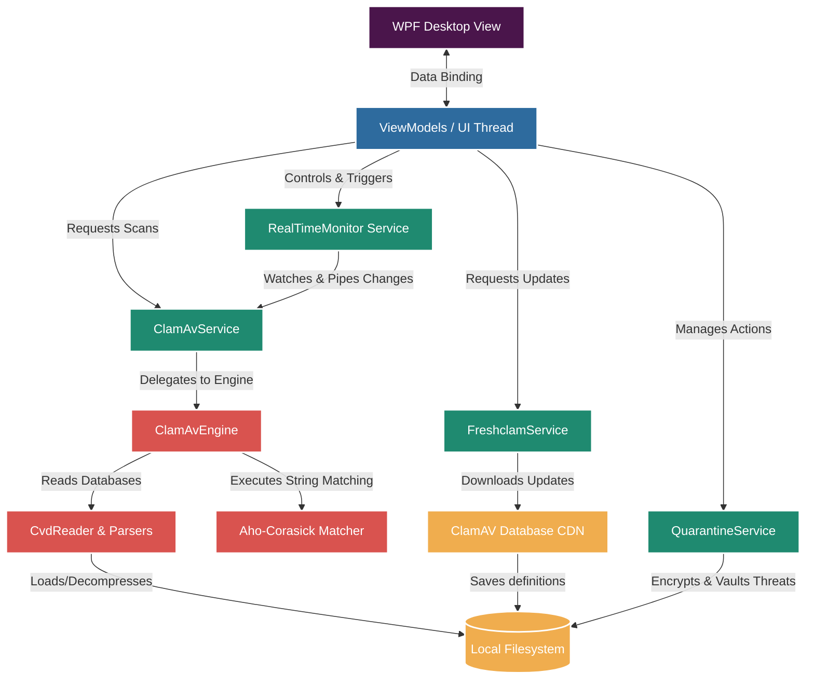
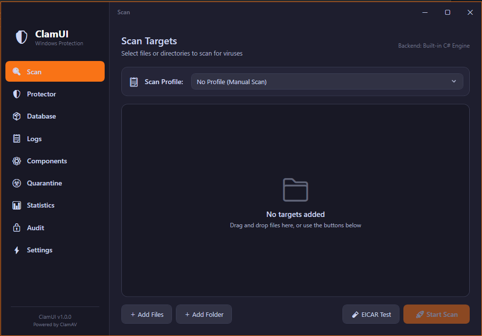
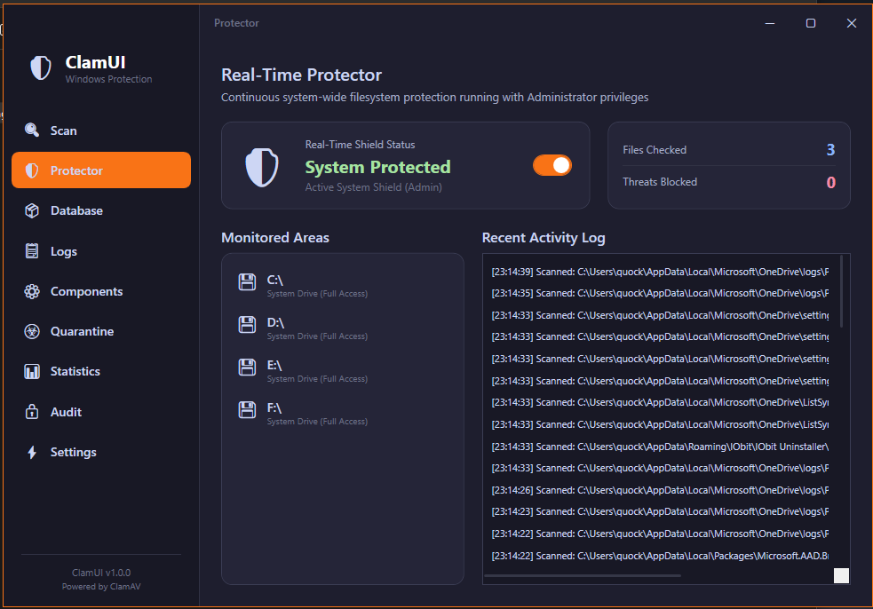
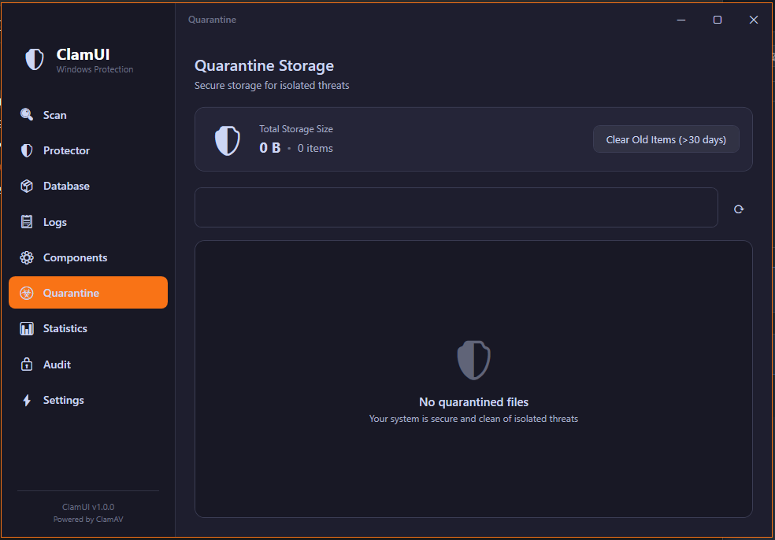
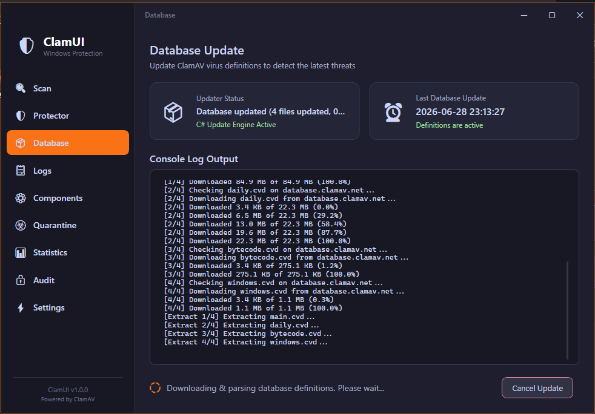
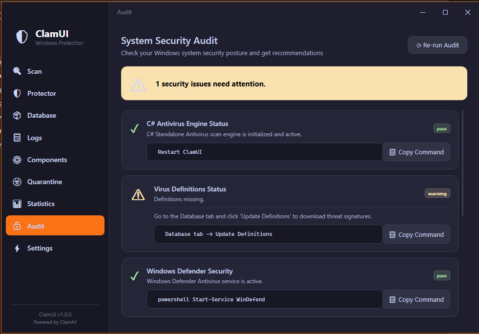
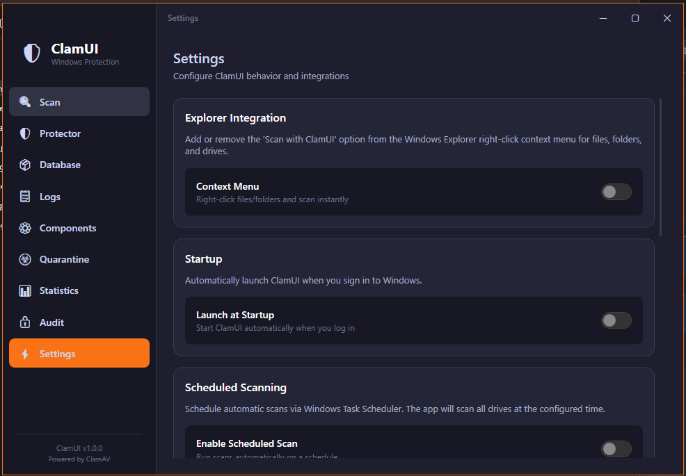
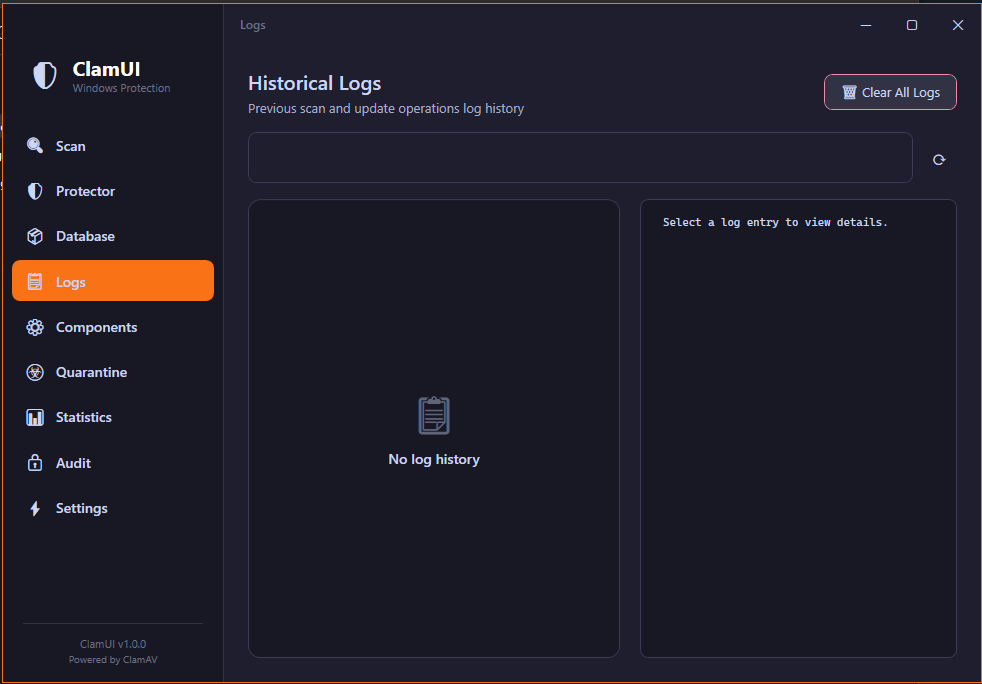
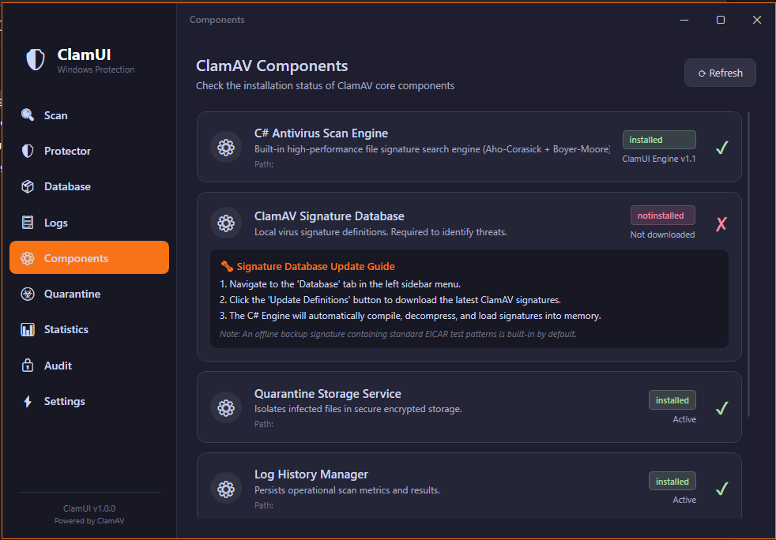
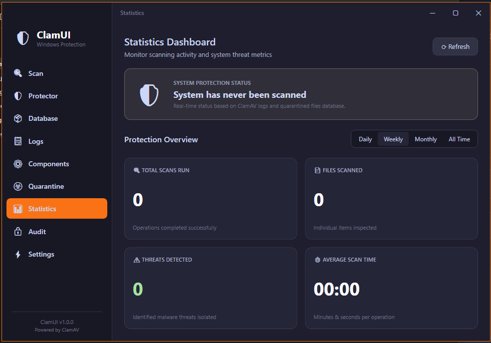

# ClamShield Antivirus

[](https://dotnet.microsoft.com/)
[](https://www.microsoft.com/windows)
[](https://learn.microsoft.com/en-us/dotnet/desktop/wpf/)
[](https://learn.microsoft.com/en-us/dotnet/architecture/modern-web-apps-azure/common-web-application-architectures)
[](https://opensource.org/licenses/GPL-2.0)

ClamShield Antivirus is a modern, high-performance, and lightweight Windows security application. Built entirely in C# and WPF on the modern .NET 10 platform, it utilizes a fully custom standalone signature scanning engine alongside a proactive, low-overhead real-time filesystem monitor to protect your PC.

Unlike typical frontends, ClamShield features a native C# implementation of the ClamAV scanning algorithm. It parses standard virus definition databases directly in-memory, eliminating the need to run or configure the resource-heavy background clamd service.

---

## Architecture Diagram

The application is structured around a decoupled MVVM (Model-View-ViewModel) design, facilitating clean division between the UI layer, background task execution, and core filesystem monitoring.



---

## Key Features

*   **Native In-Memory Engine**: Features a custom-written C# port of the ClamAV scanning engine. It loads signature databases (.cvd & .cld) directly in memory at startup, executing extremely fast lookups using a customized Aho-Corasick string-matching matcher.
*   **Proactive Real-Time Protection**: A system-wide filesystem shield that intercepts file additions and modifications on all local drives. Features a debouncing scheduler to prevent disk thrashing, and runs efficiently with an optimized 64KB internal buffer.
*   **Secure AES Quarantine Vault**: Safely isolates infected files by encrypting them with AES-256 (CBC) using machine-specific cryptographic keys. Threats are safely stored in .dat files alongside .json metadata descriptors to completely neutralize execution capabilities.
*   **Smart CDN-Aware Updates**: An embedded, robust updater that mimics official freshclam handshakes. It uses HTTP Range Requests to verify local definitions against ClamAV remote mirrors without trigger-blocking Cloudflare CDN protections.
*   **Diagnostics & Security Audit**: Includes a dedicated health checker panel scanning the configuration of Windows Defender, Windows Firewall, and the integrity of local database directories.
*   **Fully Threaded & Throttled UI**: All disk parsing, extraction (supporting .zip, .tar, .gz, .bz2, and .xz), PE parsing, and web downloads are performed asynchronously to prevent GUI thread freezing.

---

## User Interface Showcase

| Scan Center | Real-Time Shield |
| :---: | :---: |
| <br>*Manual, Custom & Folder Scanning* | <br>*Active Filesystem Monitor Status* |

| Quarantine Vault | Signature Databases |
| :---: | :---: |
| <br>*Encrypted Threat Isolation Management* | <br>*In-Memory Engine & Signature Stats* |

| Security Audit Advisor | System Settings |
| :---: | :---: |
| <br>*Windows Firewalls & Active Defender Checks* | <br>*Scan Exclusions, Schedules & Parameters* |

| Activity Log Viewer | Engine Components |
| :---: | :---: |
| <br>*Real-Time Scan Operations Log* | <br>*Detected Security System Tools* |

| Performance Statistics |
| :---: |
| <br>*Real-time Threat Metrics & CPU Scanning Load* |

---

## System Requirements & Technologies

*   **Operating System**: Windows 10 / 11 (64-bit).
*   **Framework**: .NET 10.0 Runtime.
*   **Permissions**: Administrator privileges (Required only for real-time driver/fixed disk file hooks).
*   **Libraries & Protocols**:
    *   **WPF** for modern Dark-Mode user interface design.
    *   **System.Security.Cryptography** for AES-256 Quarantine encryption and SHA-256 hash checks.
    *   **System.IO.Compression** alongside custom bzip2/xz codecs for multi-format archive unpacking.

---

## Getting Started

### Prerequisites

Ensure you have the latest .NET 10.0 SDK installed on your developer environment. 

### Building from Source

1. Clone this repository:
   ```bash
   git clone https://github.com/yourusername/clamshield_antivirus.git
   cd clamshield_antivirus
   ```

2. Restore NuGet dependencies and build the solution:
   ```bash
   dotnet build -c Release
   ```

3. Locate the built executable in the output directory:
   `clamshield_antivirus/bin/Release/net10.0-windows/clamshield_antivirus.exe`

### Database Setup

To populate your database folder with initial virus definitions:
1. Run the application and select the **Database** tab.
2. Click **Update Definitions**.
3. The program will initialize your local database/ directory with main.cvd, daily.cvd, and bytecode.cvd files directly from official ClamAV servers.

---

## Project Structure

```text
clamshield_antivirus/
├── Services/                      # Core functional services
│   ├── ClamAvEngine.cs            # Aho-Corasick matching & hash database parser
│   ├── RealTimeMonitor.cs         # System-wide FileSystemWatcher protector
│   ├── QuarantineService.cs       # AES-256 encryption threat vault
│   ├── FreshclamService.cs        # CDN-friendly database synchronizer
│   ├── PeParser.cs / CvdReader.cs # Portable Executable and CVD format readers
│   └── ArchiveScanner.cs          # Nested Archive (ZIP, TAR, GZ, XZ) unpacker
├── ViewModels/                    # MVVM presentation logic and async state wrappers
├── Views/                         # Custom-styled XAML Dark Mode views
├── Converters/                    # Custom bindings converters
├── Helpers/                       # Extension methods and platform helpers
├── Themes/                        # Visual styles, Brushes, and UI controls custom layouts
└── App.xaml                       # Application configuration and service lifecycles
```

---

## License

This project is licensed under the GPL-2.0 License. See the [LICENSE](LICENSE) file for more information.

---

*Disclaimer: ClamShield Antivirus is an educational C# project demonstrating native signature parsing, file monitoring, and cryptographic quarantining. It is not intended to replace enterprise endpoint security platforms.*
